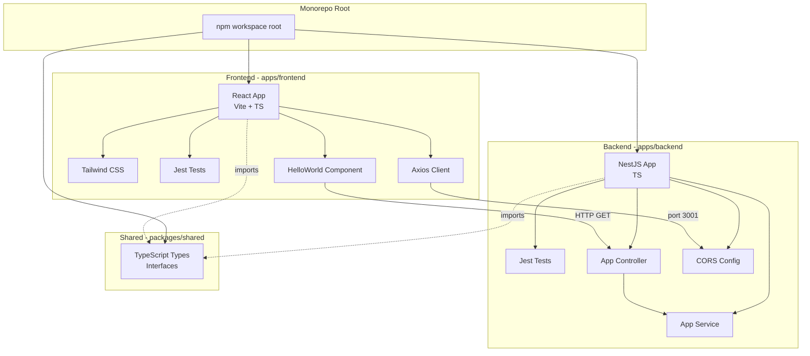
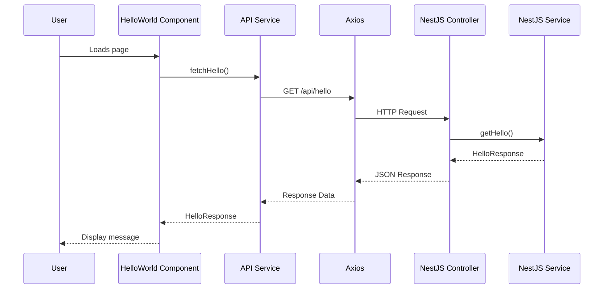

# Project Architecture Plan

## Overview
This is a full-stack monorepo application with React frontend and NestJS backend, managed using npm workspaces.

## Technology Stack

### Core Technologies
- **Monorepo Management**: npm workspaces
- **Frontend**: React 18 + TypeScript + Vite
- **Backend**: NestJS + Node.js + TypeScript
- **Shared**: TypeScript interfaces/types
- **Package Manager**: npm

### Frontend Stack
- **Build Tool**: Vite
- **Testing**: Jest + React Testing Library
- **HTTP Client**: Axios
- **Styling**: Tailwind CSS
- **Code Quality**: ESLint + Prettier
- **Port**: 3000

### Backend Stack
- **Framework**: NestJS
- **Database**: PostgreSQL
- **ORM**: TypeORM (configured, no entities yet)
- **Testing**: Jest
- **Runtime**: Node.js
- **Code Quality**: ESLint + Prettier
- **Port**: 3001

### Testing & Quality
- **Unit Testing**: Jest (both frontend and backend)
- **Coverage Target**: 80% minimum
- **Coverage Tools**: Jest built-in coverage (Istanbul)
- **Code Quality**: ESLint + Prettier
- **Linting**: Consistent code style across all packages
- **Formatting**: Automatic code formatting on save

## Project Structure

```
expenses2/
├── package.json                    # Root workspace configuration
├── tsconfig.json                   # Root TypeScript configuration
├── .gitignore                      # Git ignore rules
├── README.md                       # Setup and usage instructions
├── ARCHITECTURE.md                 # This file
│
├── apps/
│   ├── frontend/                   # React application
│   │   ├── package.json
│   │   ├── tsconfig.json
│   │   ├── vite.config.ts
│   │   ├── jest.config.js
│   │   ├── tailwind.config.js
│   │   ├── postcss.config.js
│   │   ├── .eslintrc.json
│   │   ├── .prettierrc
│   │   ├── .env
│   │   ├── .env.example
│   │   ├── index.html
│   │   ├── public/
│   │   └── src/
│   │       ├── main.tsx
│   │       ├── App.tsx
│   │       ├── App.test.tsx
│   │       ├── index.css
│   │       ├── vite-env.d.ts
│   │       ├── components/
│   │       │   ├── HelloWorld/
│   │       │   │   ├── HelloWorld.tsx
│   │       │   │   └── HelloWorld.test.tsx
│   │       └── services/
│   │           ├── api.ts
│   │           └── api.test.ts
│   │
│   └── backend/                    # NestJS application
│       ├── package.json
│       ├── tsconfig.json
│       ├── tsconfig.build.json
│       ├── nest-cli.json
│       ├── jest.config.js
│       ├── .eslintrc.json
│       ├── .prettierrc
│       ├── .env
│       ├── .env.example
│       ├── ormconfig.ts
│       ├── src/
│       │   ├── main.ts
│       │   ├── app.module.ts
│       │   ├── app.controller.ts
│       │   ├── app.controller.spec.ts
│       │   ├── app.service.ts
│       │   └── app.service.spec.ts
│       └── test/
│           └── app.e2e-spec.ts
│
└── packages/
    └── shared/                     # Shared types/interfaces
        ├── package.json
        ├── tsconfig.json
        └── src/
            ├── index.ts
            └── types/
                └── hello.types.ts
```

## Architecture Diagram



## Data Flow for Hello World Feature



## Package Dependencies

### Root package.json
```json
{
  "name": "expenses2",
  "version": "1.0.0",
  "private": true,
  "workspaces": [
    "apps/*",
    "packages/*"
  ],
  "scripts": {
    "dev": "npm run dev --workspaces",
    "dev:frontend": "npm run dev -w apps/frontend",
    "dev:backend": "npm run dev -w apps/backend",
    "build": "npm run build --workspaces",
    "test": "npm run test --workspaces",
    "test:coverage": "npm run test:coverage --workspaces",
    "lint": "npm run lint --workspaces"
  }
}
```

### Frontend Dependencies
- react, react-dom
- axios
- @shared (local package)

### Frontend DevDependencies
- vite
- @vitejs/plugin-react
- typescript
- jest, @types/jest
- @testing-library/react, @testing-library/jest-dom
- tailwindcss, postcss, autoprefixer
- ts-jest
- eslint, @typescript-eslint/parser, @typescript-eslint/eslint-plugin
- eslint-plugin-react, eslint-plugin-react-hooks
- prettier, eslint-config-prettier, eslint-plugin-prettier

### Backend Dependencies
- @nestjs/core, @nestjs/common, @nestjs/platform-express
- @nestjs/typeorm, typeorm
- pg (PostgreSQL driver)
- reflect-metadata
- rxjs
- @shared (local package)

### Backend DevDependencies
- @nestjs/cli, @nestjs/schematics
- @nestjs/testing
- typescript
- jest, @types/jest
- ts-jest, ts-node
- supertest, @types/supertest
- eslint, @typescript-eslint/parser, @typescript-eslint/eslint-plugin
- prettier, eslint-config-prettier, eslint-plugin-prettier

### Shared Package
- No external dependencies (only TypeScript types)

## Configuration Details

### TypeScript Configuration Strategy
1. **Root tsconfig.json**: Base configuration inherited by all packages
2. **Frontend tsconfig.json**: Extends root, React-specific settings
3. **Backend tsconfig.json**: Extends root, Node.js-specific settings
4. **Shared tsconfig.json**: Extends root, library-specific settings

### Environment Variables

#### Frontend (.env)
```
VITE_API_URL=http://localhost:3001
```

#### Backend (.env)
```
PORT=3001
CORS_ORIGIN=http://localhost:3000

# Database Configuration
DB_HOST=localhost
DB_PORT=5432
DB_USERNAME=postgres
DB_PASSWORD=postgres
DB_DATABASE=expenses2_dev
DB_SYNCHRONIZE=true
```

**Note**: TypeORM is configured but no entities are created yet. The Hello World endpoint does not use the database.

### CORS Configuration
Backend will be configured to accept requests from `http://localhost:3000` during development.

### Database Configuration

#### TypeORM Setup
- **Database**: PostgreSQL
- **Connection**: Configured via environment variables
- **Synchronize**: Enabled for development (auto-sync schema)
- **Entities**: None yet (infrastructure only)
- **Migrations**: To be added when entities are created

#### Initial Database Requirements
- PostgreSQL instance running on localhost:5432
- Database: `expenses2_dev`
- Username: `postgres`
- Password: `postgres`

**Important**: The initial Hello World feature does NOT require database connectivity. The database infrastructure is configured but not yet used.

### Code Quality Configuration

#### ESLint
- **Purpose**: Identify and fix code quality issues
- **Scope**: Both frontend and backend
- **Rules**: TypeScript recommended + React best practices (frontend)
- **Integration**: Run via npm scripts, IDE integration

#### Prettier
- **Purpose**: Automatic code formatting
- **Scope**: All TypeScript, JavaScript, JSON, CSS files
- **Integration**: Works with ESLint, format on save
- **Configuration**: Shared across packages

#### Formatting Rules
```json
{
  "semi": true,
  "singleQuote": true,
  "tabWidth": 2,
  "trailingComma": "all",
  "printWidth": 100
}
```

### Testing Configuration

#### Jest Coverage Thresholds
Both frontend and backend will enforce:
```json
{
  "coverageThreshold": {
    "global": {
      "branches": 80,
      "functions": 80,
      "lines": 80,
      "statements": 80
    }
  }
}
```

## API Endpoints

### Hello World Endpoint
- **Method**: GET
- **Path**: `/api/hello`
- **Response Type**: `HelloResponse` (from @shared)
- **Response Example**:
```json
{
  "message": "Hello World from NestJS!",
  "timestamp": "2025-10-27T14:23:52.317Z"
}
```

## Shared Types

### HelloResponse Interface
```typescript
export interface HelloResponse {
  message: string;
  timestamp: string;
}
```

## Development Workflow

### Initial Setup
```bash
# Install all dependencies
npm install

# Start frontend (port 3000)
npm run dev:frontend

# Start backend (port 3001)
npm run dev:backend

# Or run both concurrently
npm run dev
```

### Testing
```bash
# Run all tests
npm test

# Run tests with coverage
npm run test:coverage

# Run frontend tests only
npm run test -w apps/frontend

# Run backend tests only
npm run test -w apps/backend
```

### Building
```bash
# Build all packages
npm run build

# Build frontend only
npm run build -w apps/frontend

# Build backend only
npm run build -w apps/backend
```

## Code Quality Standards

### Testing Requirements
- All services, controllers, and components must have unit tests
- Minimum 80% code coverage required
- Tests should cover:
  - Happy path scenarios
  - Error handling
  - Edge cases
  - API integration

### TypeScript Standards
- Strict mode enabled
- No implicit any
- All interfaces/types in shared package
- Proper type exports/imports

### Code Organization
- Components in dedicated folders with co-located tests
- Services separated from components
- Shared types imported from `@shared` package
- Clear separation of concerns

## Next Steps for Implementation

1. Set up root workspace configuration
2. Initialize backend with NestJS CLI
3. Initialize frontend with Vite
4. Create shared package structure
5. Configure TypeScript paths and references
6. Set up testing infrastructure
7. Implement Hello World feature
8. Verify everything compiles and runs
9. Ensure 80% test coverage
10. Create comprehensive README

---

**Status**: Architecture planning complete, awaiting approval to proceed with implementation.