# Expense Application - Architecture & Data Flow

## 1. System Architecture Overview

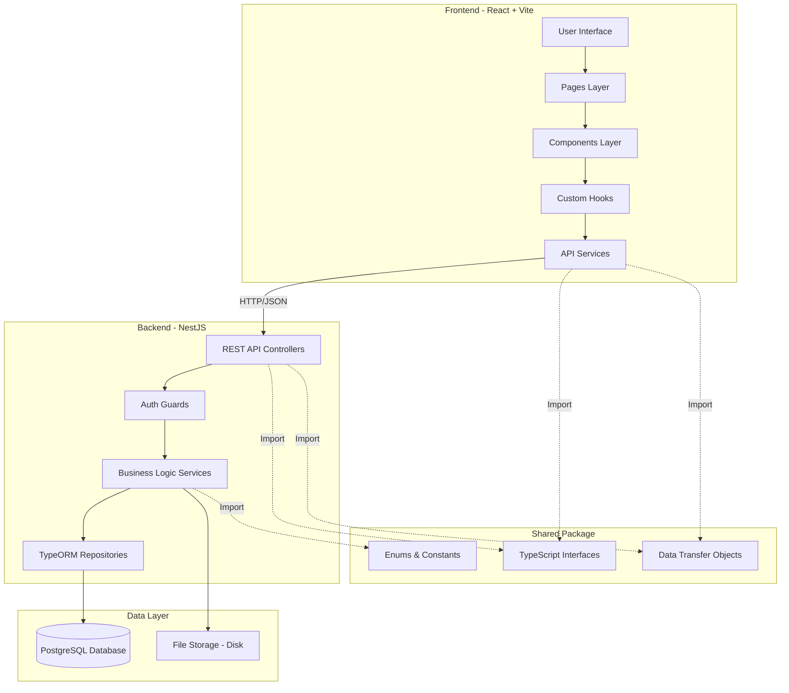

## 2. Database Entity Relationship Diagram

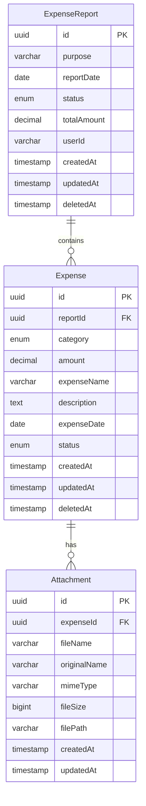

## 3. Expense Report Workflow

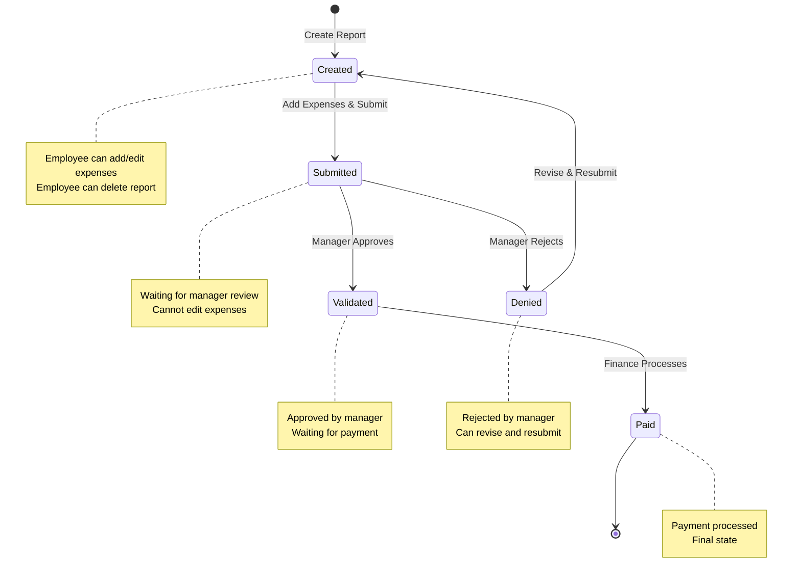

## 4. Individual Expense Status Flow

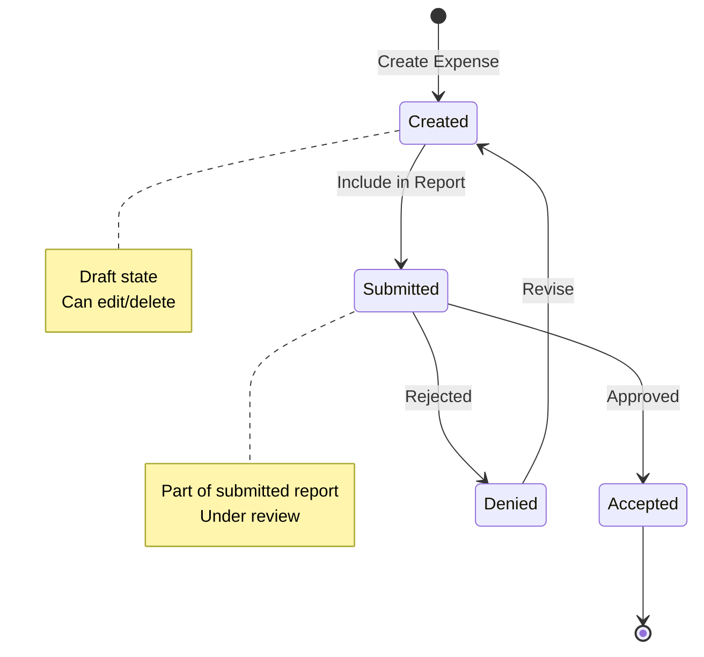

## 5. API Request Flow - Create Expense Report

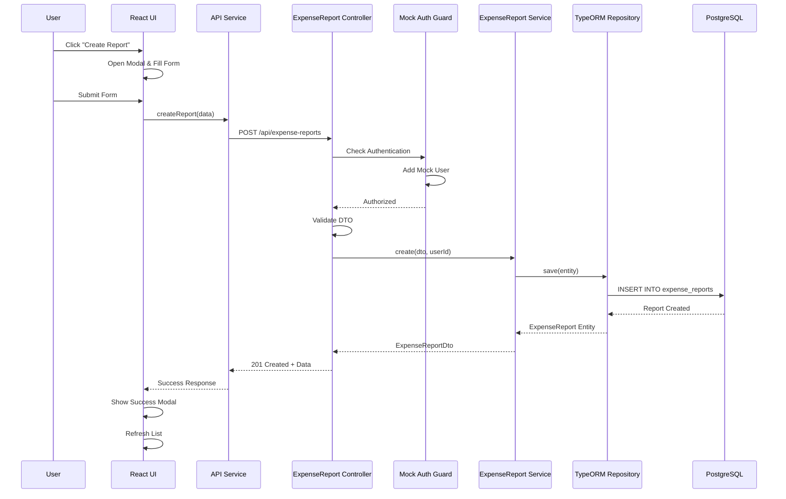

## 6. API Request Flow - Upload Attachment

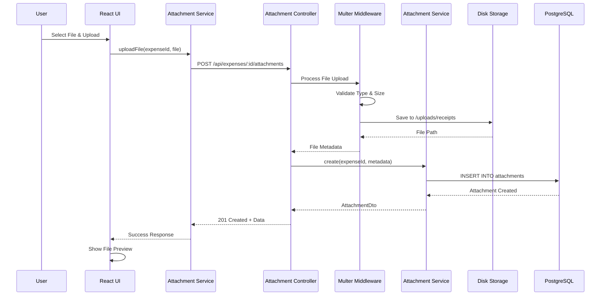

## 7. Component Hierarchy - Frontend

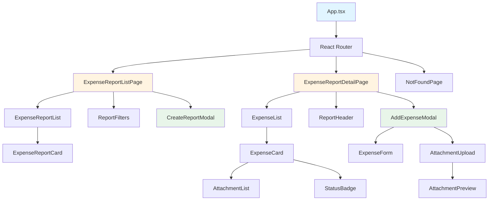

## 8. Data Flow - Complete User Journey

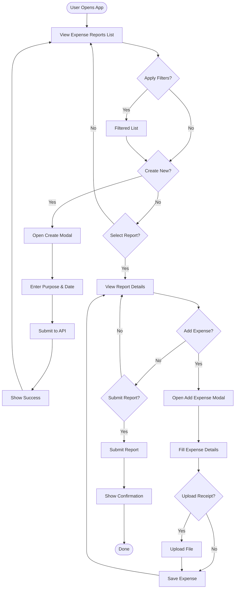

## 9. Backend Module Organization

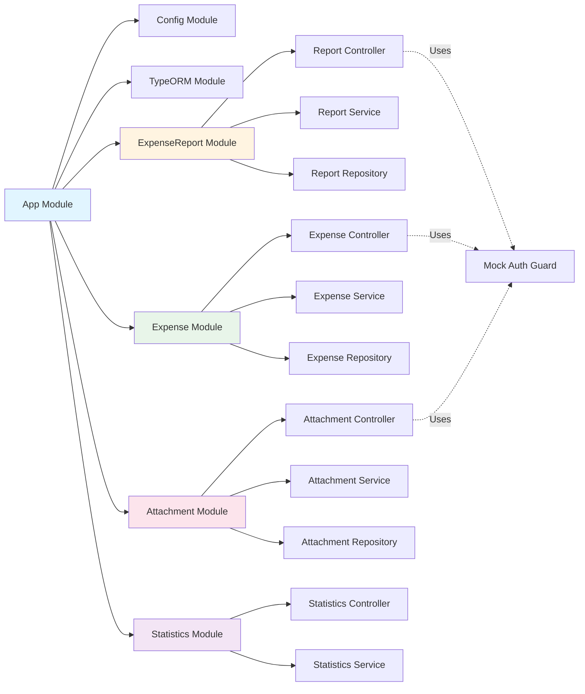

## 10. File Upload Architecture

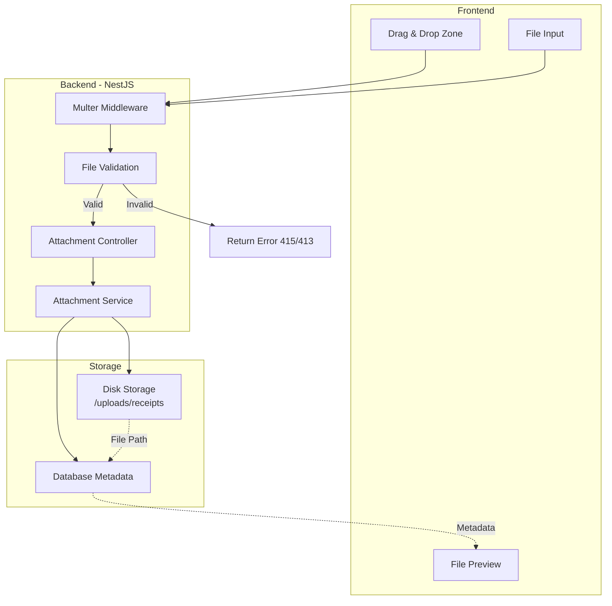

## 11. API Security & Validation Flow

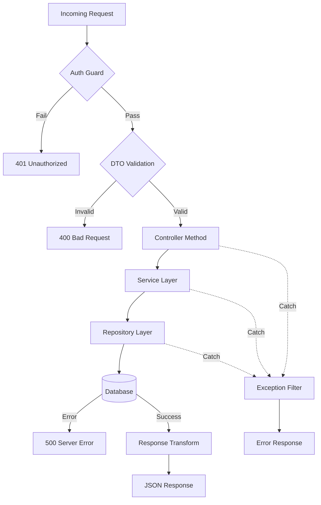

## 12. Future Architecture - With Real Auth

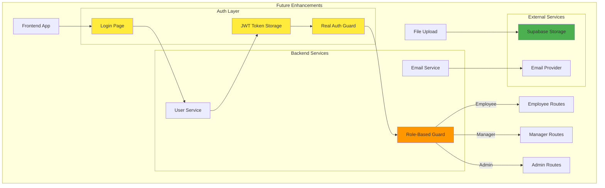

## Implementation Priority

### Phase 1: Core Backend (Week 1)
1. Database setup and migrations
2. Entity models
3. Shared TypeScript interfaces
4. Basic CRUD endpoints
5. Mock authentication

### Phase 2: Backend Features (Week 2)
6. File upload functionality
7. Swagger documentation
8. Business logic (status workflows)
9. Validation and error handling
10. Statistics endpoints

### Phase 3: Frontend Foundation (Week 3)
11. Project setup and routing
12. API service layer
13. Common components
14. Layout and navigation

### Phase 4: Frontend Features (Week 4)
15. Report list and detail pages
16. Create/edit modals
17. Expense management
18. File upload UI
19. Status indicators

### Phase 5: Polish (Week 5)
20. Testing (unit, integration)
21. Error handling and loading states
22. Responsive design refinement
23. Documentation
24. Performance optimization

---

**Ready for Implementation**: This architecture provides a solid foundation for building a scalable, maintainable expense management application.